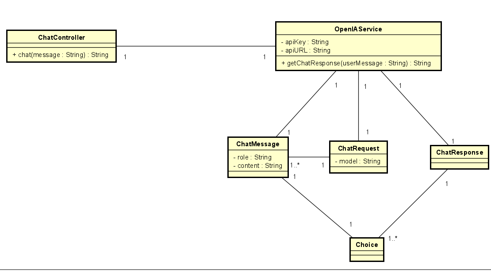
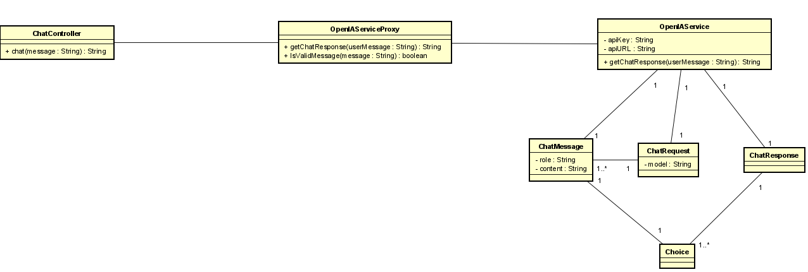
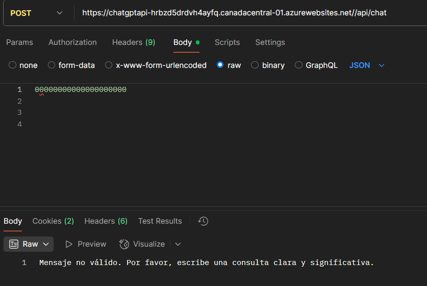

Juan Sebastian Velandia
25/06/2025


# ChatGPT API Proxy - ARSW

Este proyecto es una implementación en Java Spring Boot de un proxy para la API de ChatGPT, que optimiza las consultas mediante cacheo y validación de mensajes haciendo uso del patron de diseño proxy.

## Características

- Proxy para la API de OpenAI ChatGPT.
- Cacheo en memoria de respuestas para evitar consultas repetidas.
- Validación de mensajes para evitar enviar mensajes vacíos, muy cortos, solo números o solo símbolos.
- Fácil integración con controladores REST.

## Diagramas
Para el servicio basico, el diagrama de clases es el siguiente:


Para la optimizacion de consultas se uso el patron de diseño proxy:

## Estructura principal

- `service/OpenAIService.java`: Servicio que realiza la consulta directa a la API de OpenAI.
- `service/OpenAIServiceProxy.java`: Proxy que valida, cachea y delega las consultas.
- `model/ChatMessage.java`, `model/ChatRequest.java`, `model/ChatResponse.java`: Modelos de datos para la comunicación con la API.

## Configuración

Agrega tus credenciales y URL de OpenAI en `src/main/resources/application.properties`:

```
openai.api.key=TU_API_KEY
openai.api.url=https://api.openai.com/v1/chat/completions
```

## Ejemplo de uso

Puedes llamar al método del proxy desde tu controlador:

```java
@Autowired
private OpenAIServiceProxy openAIServiceProxy;

@GetMapping("/chat")
public String chat(@RequestParam String mensaje) {
    return openAIServiceProxy.getChatResponse(mensaje);
}
```

## Validaciones implementadas

- Mensaje no nulo.
- Longitud mínima de 3 caracteres.

- Rechazo de mensajes que sean solo números (con o sin espacios).
- Rechazo de mensajes que sean solo símbolos o espacios.

Por ejemplo:


## Ejecución

Compila y ejecuta el proyecto con:

```
mvn spring-boot:run
```

## Créditos

Desarrollado para la materia ARSW - Escuela de Ingeniería, Universidad.